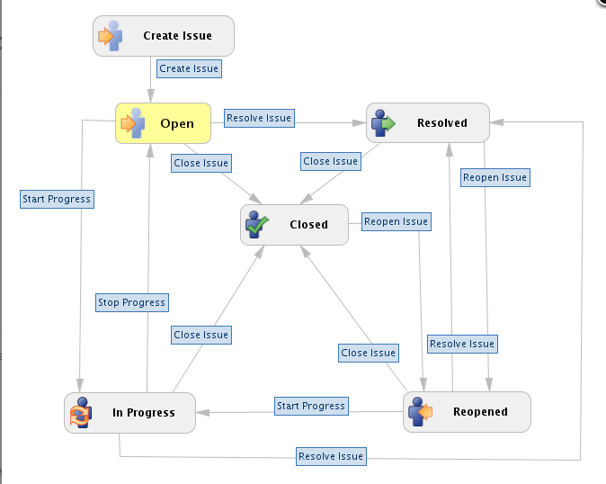

# Notes of Quality Assurance
- QA Knowledge and SDLC 
- Management Tools
- Basic QTP 

## QA Knowledge and SDLC 

### QA Basic Knowledge 3
- Agile 
- Test Case: Login Window

### QA Basic Knowledge 4 
- Essential Software Testing
- Definition 
  - IEEE829
    - The process of analyzing a software item to detect the difference between existing and required condition (that is, bugs) and to evaluate the features of the software items”
    - Art -> Engineering
    - Waterfall Project Management -> Agile 
  - ISTQB Glossary
    - “The process consisting of all life cycle activities, both static and dynamic, concerned with planning, preparation and evaluation of software products and related work products to determine that they satisfy specified requirements, to demonstrate that they are fit for purpose and to detect defects”
  - My Definition
    - Match Requirement 
    - Find more bugs 
    
### QA Basic Knowledge 5
- Failures, Defects (bugs), and Mistakes
  - Mistake, made by a human being
  - Causes a defect to be placed in a product, the defect causes no harm as long as it is not encountered by anybody 
  - End user use of the product “hit” the defect, it will give rise to failure 
  
### QA Basic Knowledge 6-7
- Testing psychology
  - Developers are viewed as “constructive”, testers as “destructive”, and the users just want to do their jobs 
- Black box testing
  - Refers to testing a software item without knowing anything about its inner working, and the testing is based on the requirement specification of what the software should do, includes specified inputs, expected outputs, and steps
  - Requirements based testing
  - Do not know how code works
- White box testing
  - Internal structure-based testing, and requires knowledge of the programming language being used  
- Gray box testing
  - Combination of white box testing and black box testing
  - Knows the internal structure using black box method
  
### QA Basic Knowledge 8
- Static Testing
  - Form of software testing where the software is not actually used
  - Check the design, documents, and read the code
- Dynamic Testing 
  - Run the testing software
  - Giving input values
  - Check the output
  - Testing based on specific test cases by execution of the test object or running programs 
- Functional Testing 
- Non-functional Testing   
- Regression testing
  - Re-run existing tests against the new release, to determine whether the changes break anything that worked prior to the change
  
### SDLC and Testing Process I
- SDLC stands for system development life cycle. The software project includes: software development, software testing, and project management. Specifically, project management is the most important and software development is the most well-structured. Disregard of quality testing and relatively few tools in testing were the 2 reasons that software testing was not popular, but this situation was getting better. Testing Process is part of SDLC.
- Basic lift-cycle models have three categories: requirement driven (waterfall) development model, iterative development model, and agile development model. Iterative development model was replaced by agile development. RDCT in development models: requirements engineering, design, coding, testing.
- The features of requirement driven model include: the customer knows what he or she wants, the requirements are frozen (changes are exceptions), and phase reviews are used as control and feedback points. The characteristics of a successful sequential development project are: stable requirements, stable environments, and focus on the big picture. According to statistic data, there is 30% change to have a successful project, due to overtime and high cost.
- Waterfall model
  - Waterfall model only has one RDCT (Requirement -> Design -> Coding -> Testing). The advantage is that process has been split into difference parts. The disadvantage is that mistakes from early state would affect significantly in the future because of later testing.
- V-model
  - V-model is a slightly improved version from waterfall model, there are related testing actives right after requirements and design, respectively. The main features: introducing more test levels, testing not only being performed at the end of the development life cycle, left side of the V is the processes to build the software product, and right side of the V is test levels to ensure that we have specified.
- W-model
  - W-model is a slightly improved version from V-model. Design and Test plan and specification are ongoing simultaneously after requirement. Test p&s and Coding are after Design. Tests are the last state with reports. Test plan and specification is the added feature from V-model. The main features: starts testing from the requirement, more time to plan and specify the test, extra test-related review of documents and code, more time to set up the test environments, and better chance of being ready for test execution as soon as something is ready to test.
  
### Test Levels
- Acceptance testing: based on and testing of the user requirements. User is majorly involved. BA (business analyst), and technical people are involved to support users' testing.
- System testing: based on and testing of the software system requirements. Testing is based on the entire system, no individual testing for units internally. Blackbox testing. 
- Component integration testing: based on and testing the implementation of the architectural design and user interface. Additional tests are required if any units are interacted with others.
- Unit testing (Component testing): based on and testing the implementation of the detailed design. For example, different developers will develop and test different units internally and individually.

### The Basic Software Testing Process (7-step)
1.	Requirement analysis
    - Customer Requirement Document
    - Software Requirement Specification (High level design document including DB design, UI design, etc.) 
    - Engineering Requirement Specification (Low level design document like coding class and function design)
2.	Test plan and Strategy
    - Test plan of table of content, including overview, features, strategies, methodologies, resources, team member, start and end, delivery, and schedule  
3.	Test Case design 
    - Many of many test cases based on SRS
4.	Build Test Environment/lab (virtual machine)
    - Check technique/lab to see if the computers are set up with right software app, like Java is ready to run
5.	Execute Test cases 
    - Run the designed test cases. 
6.	Bug reporting/track/re-test
    - According to the output, if the output is the same to the expectation, then pass. If bug is found, then report the bug, and keep tracking of it. Rerun the test case if the bugs are tested. 
7.	Final report

### Test Plan
1.	Overview 
    - 1.1.	System Overview: Business introduction
    - 1.2.	System Architecture: How we build system 
2.	 Test Strategy and Test Methodologies 
    -  2.1.	Test Strategy: High level
    - 2.2.	Test Methodologies: Different testing including web, security, etc.
3.	Scope (The main part in test plan)
    - 3.1.	Features I need to test. Ex. in “home feature model”, what kind of features are included?  -- bestseller, featured product, shopping cart, product category & review …
    - 3.2.	Features I don’t need to test
4.	Test Procedure and Process
    - 4.1.	Project Management Process (Agile)
    - 4.2.	Bug management 
    - 4.3.	Review Process
    - 4.4.	Test Case Process
5.	Entry/ Exit Criteria
    - 5.1.	Entry
      - 5.1.1.	Test Case complete
      - 5.1.2.	Application under testing 
      - 5.1.3.	Lab/ environment ready
    - 5.2.	Exit (When should we stop?)
      - 5.2.1.	 All test cases are 100% executed
      - 5.2.2.	 All test cases should 100% cover requirement or user story 
      - 5.2.3.	 High priority bugs are closed, and 90% low priority bugs are closed   
6.	Environment and Tools (Resources)
    - 6.1.	Software 
    - 6.2.	Hardware 
7.	Role and Responsibilities 
    - 7.1.	Role and title
    - 7.2.	Responsibilities (Manger, Project Manager, Leader, Tester)
8.	Deliverable and Schedule 
9.	Risk
    - 9.1.	Technique risk
    - 9.2.	Project Management
    
### Test Case
- Test Case (What’s test case?)
  - Software Tester Designed
  - To test a specific software function works correctly or not
  - Includes input and expect results
  - Includes a serial of test steps
  - Execution preconditions and references 
- What should test case include?
  - Unique ID
  - Title or name
  - Input data
  - Expected result 
- Requirements (3 levels)
  - Business requirements
  - User requirements
  - System requirements 
- Test Case Design Techniques
  - Test case design techniques are the heart of testing
  - Types: Specification-Based Techniques
    - Design test cases based on an analysis of the description of the product without reference to its internal workings
    - Black-box tests
    - Focus on the functionality 
    - Dependent on expectations to the product or system 
    - Equivalence portioning (valid and invalid): Portion the input or output into equivalence classes to create minimum number of black box tests. For example, if there are many groups of women and men, we just choose 1 woman and 1 man from each group as input to test. 
    -  Boundary value analysis (边界值)
  - Types: Specification-Based Techniques 
    - In defect-based testing, we are looking at the types of defects we might find in the product under testing
    - The techniques are therefore starting from previous experience, rather than the expected functionality or the structure of the test product
    
### Equivalence Portioning (EP) with Test Case
- Analysis of requirements
- Identify equivalence partitioning to cover the requirement (Valid vs. Invalid)
- Write test data to cover the EP
- For example, a person who is younger than 19 cannot drink alcohol, we should have 8 cases, the last 4 are enhancements. The following are Test Data.
  - EP1: <= 0 -> -1 
  - EP2: 1 to 18 -> 16
  - EP3: 19 to 150 -> 23
  - EP4: > 150 -> 189
  - EP5: age is blank
  - EP6: float number (10.6), 
  - EP7: in English words (nineteen or ‘19’)
  - EP8: out of range number (999999999999999999999999999999)
- Test Case: can be combined if expected results and testing procedure are the same
  - Test age >= 19 can drink alcohol – EP3 
    - Step 1: Enter age 
    - Step 2: Press Check button
    - Expect result: get a message says “You can drink alcohol”
  - Verify age from 1- 18 cannot drink alcohol – EP2 
    - Step 1: Enter age 
    - Step 2: Press Check button
    - Expect result: get a message says “You cannot drink alcohol”
  - Verify the system can handle the age not in normal range – EP 1 & 4
    - Step 1: Enter age 
    - Step 2: Press Check button
    - Expect result: get a message says “System cannot accept the age”
  - Verify the system can handle the invalid input – EP5 & 6 & 7
    - Step 1: Enter age 
    - Step 2: Press Check button
    - Expect result: get a message says “Your input form is not valid”
  - Verify the system can handle integer overflow – EP8
    - Step 1: Enter age 
    - Step 2: Press Check button
    - Expect result: get a message says “Integer Overflow”
    
### Static Testing Objects: Everything that can be read
- Types：
  - Informal review 
    - Review the document 
    - Objectives are very individual depending on the author’s needs
    - No formal process
  - Walk-through: Step-by-step presentation of a document by the author (presenter)
  - Technical review (aka peer review)
    - Peer group discussion activity on the technical approach to find defects and make technical decisions
    - Formal, role includes moderator, author, reviewer, and recorder 
  - Management review: Major objective is to monitor progress
  - Inspection: Strick version of tech review with similar process 
  - Audit: The most formal one with external auditors involved 
- What is the tech review process?
  - Author finishes writing test plan, picks up team members and their rules to review, schedules meeting, and sends the document to everyone.  
  - Every member should read the document before attending the meeting
  - Attend the meeting. Moderator takes care of time, like test plan is X pages long and should finish the review in X hours
  - Members review the document, answer questions, talk about issues, and provide feedback. Recorder will take note for the issues. 
  - Decision. Find minor issues and the plan will be passed if the issues can be fixed 
  - Author fixes and re-rends quick review to everyone 
- Online review (code review)
  - Similar to the tech review but no recorder and no moderator 
  
## Management Tool

### Agile Overview
- Definition 
  - Scrum is an agile process that allows us to focus on delivering the highest business value in the shortest time.
  - It allows us to rapidly and repeatedly inspect actual working software (every two weeks to one month).
  - The business sets the priorities. Teams self-organize to determine the best way to deliver the height priority.
  - Every two weeks to a month anyone can see real working software and decide to release it as it or continue to enhance it for another sprint
- Values (Why Agile is better or the differences between Agile and requirement driven)
  - Individuals and interactions over process and tools  
  - Working software over comprehensive documentation
  - Customer collaboration over contract negotiation 
  - Responding to change over following a plan 
  
### Scrum Overview
- General Process of Scrum
  - Product backlog: listed all requirements based on priority, high to low
  - Sprint: 2 – 4 weeks, 1 day cannot be a sprint because it is too short 
  - Sprint backlog: “plan” that divides big task into smaller tasks, usually holds a 3-hour meeting  
  - Daily sprint meeting: spends 10 to 15 minutes to discuss “what I did yesterday and what I am doing today” including non- technical issues. Issues will be fixed after meeting 
  - Potentially shippable product increment: demo the product to customer. If there is anything that customer does not agree, we put customer’s feedback at the bottom of product backlog. The new product backlog will be going through at the beginning of next sprint
  
### Scrum Framework 
- Roles 
  -	Product owner: define the features of the product, decide release date and content
  - ScrumMaster: management to the project, like informing everyone how the project goes and interactions between different tasks 
  - Team: typically, 5 – 9 people to finish assigned tasks
- Ceremonies
  - Sprint planning: the plan that made at the beginning of a sprint in order to have sprint goal and sprint backlog. Team capacity, product backlog, business conditions, current product, technology are considered. 
  - Sprint review: the review of the accomplishment at the end of sprint 
  - Sprint retrospective: similar to sprint review – recall the positive and negative things that we’ve done at the end
  - Daily scrum meeting: a short meeting to discuss what we did yesterday, what we are doing for today, and any issues in your way, but not for problem solving
- Artifacts
  - Product backlog 
  - Sprint backlog 
  - Burndown charts
  
### Rally Management 
- Project – online Shopping System
- Bug Management with Jira

### Bug Process and Status
- Bug Process and Status

- Create Issue
  - who can create bug (QA, Dev, Support)
  - customer can not create bug directly. Customer create &quot;case&quot;, and then support team converts this &quot;case&quot; to &quot;BUG&quot;
  - internal bug, customer bug
  - The status of new created bug is &quot;open&quot;
- Open --- (Start Progress) ---> In Progress
  - If the assigner is &quot;Dev Leader&quot;, what will the dev leader do?
    - Review the bug, if it is not a real bug, we will take later.
    - If need more study, he will re-assign the bug to developer to study it.
    - If the bug is confirmed, he will &quot;assign&quot; a developer to work on it.
  - If you are developer, and you are assigned to this bug. What will you do?
    - change status from &quot;open&quot; to &quot;in Progress&quot;
    - If there is enough information to reproduce the bug start fixing. If there is not enough information ask QA for more information.
    - Working on fixing the bug (locate the problem, remove the problem), this task will take for a while.
  - As a QA, we help developer to reproduce the problem (provide the details information, such as screenshot, environment, steps).
- &quot;In Progress&quot; --- (Resolved Issue) ---> Resolved
  - The developer will change the status to &quot;resolved&quot; after he fixes the problem (Dev tests the problem by himself in his own environment, and he may does not do the regression testing).
- &quot;Resolved&quot; --- close the bug ---> &quot;Closed&quot;
  - QA will re-test (test on more environments and do regression test). Mini regression testing, only test related features? How do you know which featured will be affected?
  - Source code control system used for developer. The developer will put the code change information into the bug. Most companies allow QA read the code, but do not allow QA to make changes the code. By reading the code, we can understand better which feature may be affected.
  - Release notes &amp; developer notes
  - QA starts to work on the test if the problem is gone, and no new problem is found, we are done.
  - QA changes bug status to &quot;closed&quot;
- &quot;Open&quot; ---> &quot;Resolved&quot;
  - Developer changes the status to &quot;resolved&quot; because he thinks that this bug is not required to be worked on. For example, duplicated, not worth to fix, will fix in further future, invalid bug.
  - QA&#39;s low-quality performance
- &quot;Open&quot; ---> &quot;closed&quot;
  - By developer, and it means that there is a lower quality than &quot;Open ---> Resolved&quot;
- &quot;Resolved&quot; ---> &quot;Reopen&quot;
  - By QA, and it means that &quot;developer thinks this problem has been fixed, but he is wrong&quot;
  - Dev&#39;s low-quality performance
- &quot;Reopen&quot; ---> &quot;Resolved&quot;
  - By developer, and it means that the developer&#39;s work is done and it&#39;s ready for QA to test

## QTP and basic

## QTP Version
- 11.5 – Released in Dec 2012
- 11.0 – Released in 2010
- 10.0 – Released in 2009
- 9.5 – Released in 2008

## Create automation test case (Code &amp; Record)
- High level: code
- Low level: record

## Create single QTP script in daily work
- Prepare – Setup for test automation
  - Document manual test steps
  - Check environment is ready and data is valid
- Create – Create basic test
  - Create the test script and confirm playback
- Enhance – Enhance basic test
  - Use QTP features, like splitting different functions into different actions
  - Insert checkpoint
  - split parameters into action parameter and split data into data table
- Product – production
  - Put it into framework after making sure everything is running well
